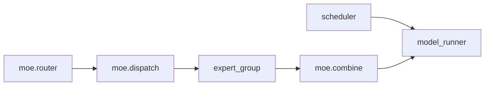

<div align="center">
  
  <h1>Artifact-Infer</h1>
</div>

Yet another inference engine friendly for beginners and users. 

## Design Ideas

*Build your inference engine like legos.*

DIY an inference engine from scratch or adapt from existing ones is difficult. Therefore a good start should make a beginer/developer feel ***"I can add code to some place that should appear in an existing inference engine"***. 

To achieve this, this repo is built upon two concepts: **Service** and **Artifact**. For a brief review, refer to document [l1](docs/l1/outline.md). 

## Why these core features

Artifact-Infer aims to make inference engine development feel like assembling
legos. A developer should be able to add or replace one module without first
understanding every detail of the whole engine.

As the engine grows, however, it becomes difficult to answer two basic
questions:

1. What components will actually be connected and executed?
2. Where does an accuracy difference first appear?

The registry graph and tensor snapshot features are designed to answer these
questions.

### Module registry and graph compile

An inference engine is built from many modules, such as the scheduler, block
manager, attention backend, MoE backend, and model runner. Different recipes
may replace some of these modules or connect them in different ways.

Artifact-Infer uses a registry to record these components and their
connections. Before execution, a lightweight **graph compile** process will:

- resolve the methods and states provided by each component;
- check whether required connections are present;
- reject invalid or cyclic graphs early;
- produce the actual component graph used by the engine;
- make the graph available for visualization and debugging.

This is not a compiler for model kernels. It does not rewrite the model or add
runtime overhead to normal execution. It compiles a readable recipe into an
explicit and validated engine structure.

Developers can therefore continue to write and combine normal Python modules,
while still being able to inspect the real execution path before running a
large model.

Minimum example: [compile two registered modules into JSON](examples/registry_compile.py).

```bash
uv run python -m examples.registry_compile
```

### Registry graph visualization

The compiled registry can be rendered as JSON, Mermaid, or DOT.

A visualization makes it easier to compare different extensions and recipes.
For example, we can directly see whether a recipe uses a dense MLP or MoE,
which communication backend is selected, and how modules are placed across
pipeline stages.

The visualization is generated from the registry itself. It should describe
the graph that will actually run, rather than a separate diagram that may
become outdated.

### Tensor snapshot and replay

Accuracy issues are difficult to debug at inference-engine scale. Comparing
only the final token or logits tells us that two executions are different, but
not where the difference begins.

Tensor snapshots record a small fingerprint for selected module inputs and
outputs. A snapshot may contain:

- the module and tensor name;
- shape, stride, dtype, and device information;
- request, layer, rank, and execution-stage metadata;
- a fast tensor hash produced on the device.

The full tensor does not need to be copied or stored by default. This makes it
possible to compare every layer or module with a much smaller storage and
communication cost.

When two executions disagree, Artifact-Infer can compare their snapshots and
report the first divergent layer, module, rank, or request. This is especially
useful when moving from one GPU to tensor, expert, or pipeline parallel
execution.

Minimum example: [find the first divergent module between two runs](examples/tensor_snapshot.py).

```bash
uv run python -m examples.tensor_snapshot
```

Replay builds on the same snapshot and registry information. It allows a
recorded operation or execution segment to be run again with its original
inputs and conditions. Together, snapshot and replay make accuracy debugging a
core engine capability rather than a collection of model-specific debug
scripts.

### One debugging story: MoE works on one GPU but fails with expert parallel

Suppose a model produces the expected tokens on one GPU. After enabling an MoE
extension on eight GPUs, the final logits become different. Looking only at the
last output does not tell us whether the problem is in routing, all-to-all
communication, one expert, or result combination.

First, compile the actual registry before loading the large model:

```python
graph = registry.compile()
```

The compiled graph may show that `moe.combine` was created but never connected
back to `model_runner`. A cyclic extension is rejected directly:

```text
RegistryCompileError: Cycle detected: moe.dispatch -> moe.combine -> moe.dispatch
```

After fixing the registry, render the same graph instead of drawing a second
architecture diagram by hand:



This view makes it easy to check which MoE and communication extensions were
selected, where the expert group is connected, and which modules belong to a
pipeline stage.

If the graph is correct but the result is still different, compare a trusted
single-GPU snapshot with the expert-parallel snapshot:

```python
difference = first_snapshot_difference(reference, expert_parallel)
print(difference.key)
```

An example result is:

```text
module:    model.layers.17.moe.combine
tensor:    output
call:      0
rank:      3
reference: 0x72ba6d85f41c9910
candidate: 0x391ec21477d052ae
```

We now know that layers 0--16 matched and the first observable difference is
the combine output on layer 17. Instead of dumping every tensor from every
GPU, the developer can inspect one small execution boundary and the relevant
ranks.

The intended next step is to save the inputs and execution metadata around
`moe.combine`, then replay only that component. The current snapshot work
stores fingerprints for localization; saving tensor payloads and running the
replay are follow-up features.

The intended workflow is:

1. compile and inspect the registered engine graph;
2. run the engine and capture selected tensor fingerprints;
3. compare snapshots to locate the first divergence;
4. replay the smallest relevant component or execution segment;
5. fix and verify the implementation before returning to a full-scale run.

These features keep normal development simple, while giving the engine stronger
tools when the model, hardware topology, and number of extensions become
larger.

## About documents

The rest of the documents should include a brief ideas of how each version implement some function. These documents may also include some interesting observation from some buggy feature. 

The versions may not be necessarily consecutive, we may need a tree structure for contents later. 

## Testing and developing

This repo is built upon `flash-attn`, `flashinfer-python`, `torch`, `transformers`. Please make sure these core packages does not contradict with each other. For the rest dependency, install them when needed. 

You can run evaluate script by `python -m eval.test_aime` for example. 

Evaluating inference engine is an important issue and still in development.

You should be able to develop on any version with its name listed under src/artifacts and src/services. The name suggest the version directly. In future, there may be steady release of some artifacts and services, which will be named without a version descriptor. 
